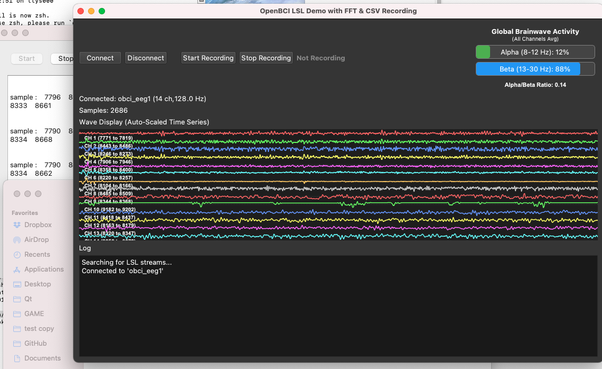
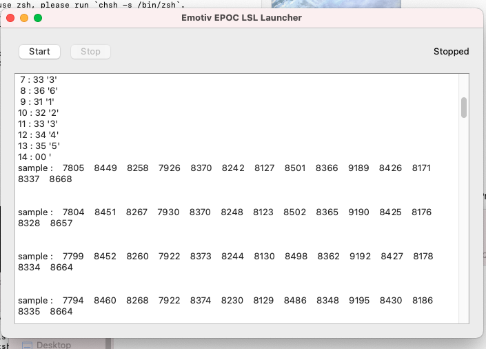

# EpocEmotiv-Driver

tested working on macos , would assume linux and windows work too without modifications. 

test/epoc_demo.c    gcc epoc_demo.c -lmcrypt -L./ -lhidapi

working

the stuff in the main branch is for a LSL driver to other GUI's

epoc_demo.c compile is epoc_lsl - lsl streamer

LSLViewer-QT for checking LSL connections out
QBCI - for viewing Brainwaves like OpenBCI
LSLDriverLauncher - frontend for epoc_lsl

if both lights are stuck on on the dongle unplug it before starting it up it should be reading samples before you open other applications

seems to be slower with the launcher so maybe use the epoc_lsl on its own